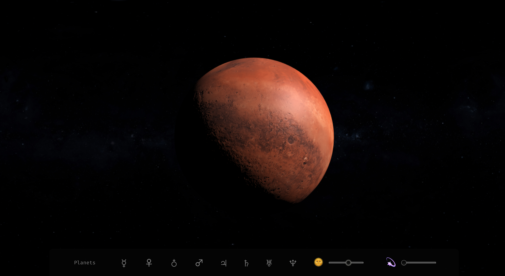

## PLANETARIUM

## An app for planet-gazing 🌒, made in [React](https://reactjs.org/) and [Three.js](https://threejs.org/).

## [Planetarium on Heroku](https://sidiousvic-planetarium.herokuapp.com/) 💫

  
</img>
  
  

## Click and drag to move a planet. ✋🏼

</img>
  
  

## Scroll to zoom in and out. 🔍

</img>

built by [sidiousvic](https://github.com/sidiousvic)
